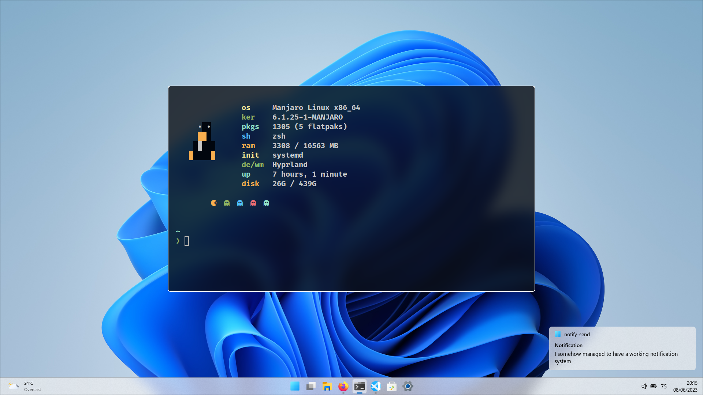
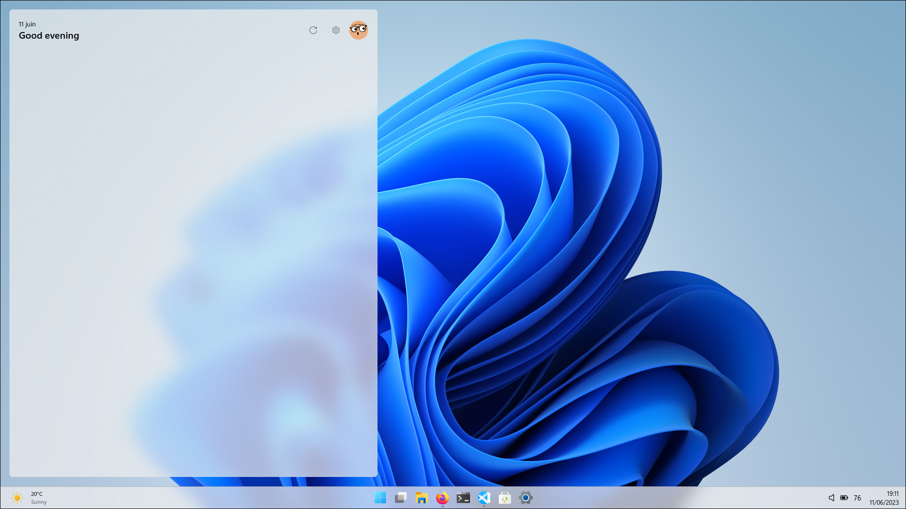

<div align="center">
  
  <br />
  <h1 align="center">
    Hyprland 11
  </h1>
  <p>
    <i>A Windows 11 look for Hyprland</i>
  </p>
</div>

> NOTE: This is under development.
> It is not recommended to use this config for a daily driver.

<br>



<br>

<div align="center">
	<a href="https://github.com/Shinyhero36/dotfiles/stargazers">
		
  </a>
	<a href="https://github.com/Shinyhero36/dotfiles/releases/latest">
		
  </a>
	<a href="https://github.com/Shinyhero36/dotfiles/issues">
		
  </a>
</div>


## :memo: Details

- **OS**: [Arch Linux](https://archlinux.org/)
- **Compositor**: [Hyprland](https://hyprland.org/)
- **Widgets**: [Eww](https://elkowar.github.io/eww/)
- **Notifications**: [Eww](https://elkowar.github.io/eww/) + [Tiramisu](https://github.com/Sweets/tiramisu)
- **Wallpapers**: [WallpaperHub](https://www.wallpaperhub.app/wallpapers/9256)
- **Terminal**: [Alacritty](https://github.com/alacritty/alacritty)
- **Fetch script**: [Rxfetch](https://github.com/Mangeshrex/rxfetch)
- **Fonts**:
  - [Segoe UI Variable](https://learn.microsoft.com/en-us/windows/apps/design/downloads/#fonts)

## :camera_flash: Gallery

<details>
<summary>Click to see more screenshots</summary>



</details>

## :construction: Installation

```bash
yay -S ...
```


## :keyboard: Keybinds

All keybinds can be found in [keybinds.conf](config/hypr/keybinds.conf)

| Keybind | Action |
| --- | --- |
| `Super + Enter` | Open terminal |

---

<div align="center">
	<a href="https://github.com/Shinyhero36/dotfiles/blob/main/LICENSE">
		
	</a>
</div>

